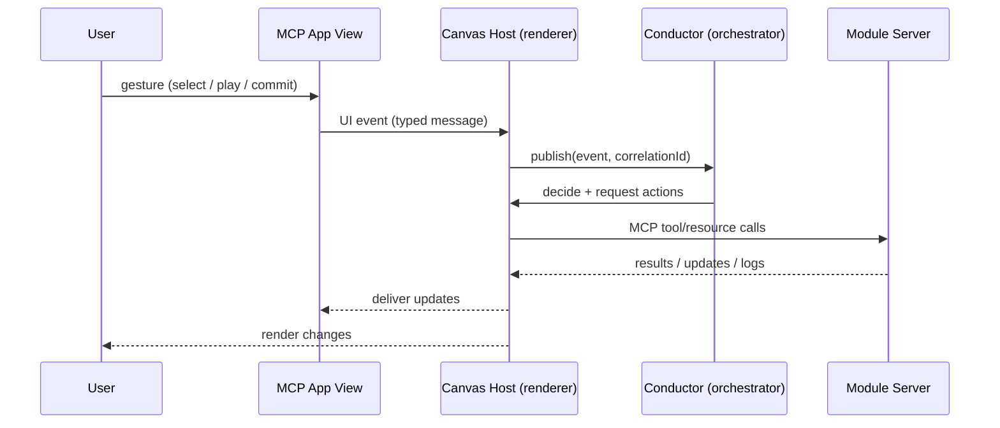
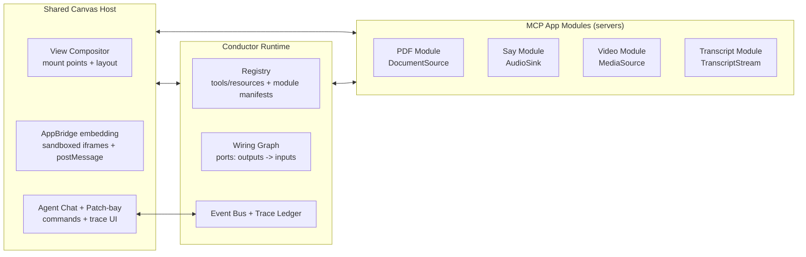

# `mcp-canvas-conductor`

A TypeScript toolkit for building a **shared canvas** that mounts **multiple MCP Apps** (interactive `ui://` Views) and coordinates them through a **conductor** (orchestrator).

This repo is optimized for **internal prototyping**: fast iteration, rich “composability demos,” and clear boundaries between **canvas**, **conductor**, and **modules**—without committing to the final production “how” yet.

> MCP Apps are interactive HTML interfaces that render inside MCP hosts and communicate via a `postMessage`-based dialect of MCP; hosts render them in a sandboxed iframe and mediate tool access. ([Model Context Protocol][1])

---

## What you get

### Conductor runtime (the “orchestra pit”)

* **Capability discovery + inventory** for tools/resources/prompts (and change reconciliation when lists change).
* **Module registry** driven by a minimal **manifest** convention (ports + mountable views + state surfaces).
* **Wiring graph**: connect module outputs → module inputs with schema-checked contracts.
* **Event bus**: unify UI events, tool results, resource updates, logs, progress/cancel.
* **Flight recorder**: correlation IDs + trace timeline so you can answer “why did the canvas do that?”

### Canvas host scaffolding (the “stage”)

* Multi-view compositor with **mount points** (main, sidebar, overlay, PiP/fullscreen if supported).
* Integrates MCP Apps embedding via **AppBridge** (iframe sandbox + message plumbing + tool proxying). ([modelcontextprotocol.github.io][2])
* An **Agent Chat** “command deck” that can act with full conductor context (mount/wire/call tools) while streaming “what’s happening” as the canvas changes.
* A “patch-bay” debug overlay that shows mounted modules and live wiring.

### Demo harness (“Conductor Proving Ground”)

Composable scenarios using upstream MCP Apps examples (PDF + Say + Video + Transcript) to prove:

* swappable modules (PDF ↔ Video)
* coordinated behaviors (read → speak, watch → subtitles)
* traceability (event + tool-call timeline)

> ext-apps includes a reference `basic-host` example and explicitly notes there’s no supported host implementation beyond examples—hosts either use MCP-UI or roll their own. ([modelcontextprotocol.github.io][3])

---

## Current implementation status (Feb 2026)

- `packages/contracts`: runtime profile + swap + wiring + event-envelope contracts are live.
- `packages/conductor`: event-sourced runtime APIs are implemented (`register`, `discover`, `mount`, `wire`, `swap`, `emitPortEvent`, `trace`).
- `packages/canvas-host`: browser host now connects to PDF/Say, mounts MCP Apps with AppBridge, shows inventory, wiring, and trace overlays.
- `packages/cli`: operational commands are implemented:
  - `mcp-canvas probe`
  - `mcp-canvas dev`
  - `mcp-canvas connect --id --url --profile`
  - `mcp-canvas wire --from --to`
  - `mcp-canvas swap --from --to --mode auto`
  - `mcp-canvas trace --tail`
- `examples/proving-ground`: includes protocol probe, module profiles, and Scenario A (`read-listen`) script.

### Transport baseline

The conductor baseline is **stateless Streamable HTTP** at the module boundary.  
Session-oriented modules require a transport adapter and are rejected otherwise.

---

## The weird part (and why it’s incredible)

If this concept feels esoteric, that’s a good sign — it’s a genuinely new separation of concerns.

In a “normal” web app, the UI *is* the system: one codebase owns the DOM, owns the state, and calls functions directly.

In a shared canvas, the UI is **multiple sandboxed mini-apps** (MCP Apps) mounted side-by-side — and the *system* becomes the thing that coordinates them:

- The **Canvas Host** renders views (and decides layout, theming, sandbox policy, what’s allowed).
- The **Conductor** never “looks at pixels.” It operates on a **typed event stream** + **capability inventory**:
  - what tools/resources each module exposes
  - what views are mounted and where
  - what each module’s current state surface is
  - what wiring edges are active (outputs → inputs), and whether schemas match
  - a traceable “why chain” of cause → effect across apps

### A concrete analogy (VS Code + Codex)

When you see a rendered Mermaid diagram in chat, that rendering is a **host feature**.
What the agent gets is the **source** (the Mermaid text) plus structured signals (tool calls, outputs, context snapshots).

This prototype takes that same split and turns it into a product:

- **You** see: a PDF view, a TTS view, a transcript overlay, a debug patch-bay.
- The **conductor** sees: selection events, playback state, transcript chunks, tool schemas, resource updates, logs — all correlated.

### What you see vs what the conductor “sees”

| You experience | The conductor receives / maintains |
| --- | --- |
| “A PDF is open in Main” | Mounted view instance (`resourceUri`, display mode, lifecycle state) |
| “I highlighted this paragraph” | Output event like `DocumentSource.selectionText: string` + correlation ID |
| “Audio started playing in PiP” | Tool call `AudioSink.speak({ text })` + progress/cancel + playback status updates |
| “Why did that happen?” | Timeline: user gesture → UI event → tool call → tool result → downstream updates |

### Turns: the conductor’s “chat loop,” but for a canvas

The conductor behaves like a turn-based agent, except its “prompt” is the canvas:

1. A user gesture (or server update) emits an event from some view/module.
2. The host forwards it into the conductor’s event bus with correlation metadata.
3. The wiring graph deterministically routes outputs → inputs (schema-checked).
4. The host executes the resulting tool calls (still capability-gated and sandboxed).
5. Views update, and the flight recorder writes the causal chain.



This is the heart of the demo: **multi-app feels like one instrument panel** because the conductor holds the shared truth — without breaking sandbox boundaries.

### The missing magic: “chat that can see the canvas”

This is the leap from “chat that can *show* things” to “chat that can *operate* a cockpit.”

The chat isn’t only a place where you *talk about* what’s on screen — it’s a place where you can ask for outcomes, and the agent can safely do the mechanical work because it has conductor context.

Example (“watch movie A”):

```text
User: I want to watch “Movie A”.

Agent: Checking canvas state… no MediaSource mounted.
Agent: Mounting Video module → main…
Agent: Searching catalog for “Movie A”…
Agent: Loading media into the Video view…
Agent: (Optional) Mounting Transcript → overlay and wiring subtitles…

System: Video mounted (main). Playback started.
System: Transcript mounted (overlay). Subtitles live.
```

While that’s happening, you’re watching the canvas UI change in real time — and you always have a “why did that happen?” timeline if something surprises you.

---

## Non-goals (by design)

* Production authentication, hardened authorization, multi-tenant sandbox policy tuning
* High-scale performance work (owned by other teams)
* Choosing the final conductor architecture (rules vs plan graph vs hybrid). This library supports exploration.

---

## Prerequisites

* Node.js **18+** (recommended for MCP Apps workflows). ([Model Context Protocol][1])
* A host environment capable of rendering MCP Apps (this repo provides a dev host scaffold using AppBridge). ([Model Context Protocol][1])

---

## Installation

### As a library (workspace / internal registry)

```bash
pnpm add mcp-canvas-conductor
# or
npm install mcp-canvas-conductor
```

### For dev (recommended monorepo layout)

```bash
pnpm install
pnpm build
```

---

## Repository layout

```text
packages/
  conductor/           # conductor runtime, registries, wiring graph, trace ledger
  canvas-host/         # shared canvas host, view compositor, patch-bay UI
  contracts/           # manifest schema + port contract helpers (zod/json-schema)
  cli/                 # `mcp-canvas` CLI (run host, run scenarios)
examples/
  proving-ground/      # demo scenarios composed from upstream ext-apps examples
  modules/             # optional local demo modules (thin wrappers)
docs/
  MCP-Apps-and-the-Conductor-for-Shared-Canvas-Multi-App-Experiences.md
  Shared-Canvas-Conductor-Reference:-MCP-Apps-and-Core-MCP-Primitives.md
```

---

## Docs

See [`./docs`](./docs) for design context and implementation references:

- [`MCP-Apps-and-the-Conductor-for-Shared-Canvas-Multi-App-Experiences.md`](./docs/MCP-Apps-and-the-Conductor-for-Shared-Canvas-Multi-App-Experiences.md): Product-oriented overview of the shared-canvas/conductor concept, goals, architecture, and demo scenarios.
- [`Shared-Canvas-Conductor-Reference:-MCP-Apps-and-Core-MCP-Primitives.md`](./docs/Shared-Canvas-Conductor-Reference:-MCP-Apps-and-Core-MCP-Primitives.md): Technical reference mapping conductor patterns to MCP Apps and core MCP primitives, with protocol-level implementation notes.
- [`THIS-IS-WEIRD.md`](./THIS-IS-WEIRD.md): A deliberately detailed “why/how does this even work?” mental model for humans and agents.

---

## Core concepts

### Canvas

A host runtime that:

* renders multiple MCP App Views (sandboxed iframes)
* exposes mount points + layout
* mediates tool access to servers (via AppBridge)

> MCP Apps run in a sandboxed iframe; the host controls which capabilities an app can access (e.g., which tools an app can call). ([Model Context Protocol][1])

### Conductor

A coordination runtime that:

* discovers what each module can do (tools/resources + module manifest)
* keeps an inventory of mounted views and state surfaces
* wires module ports together
* maintains a traceable causal chain of actions

### Agent Chat (the “pilot”)

A chat surface inside the host that:

* accepts high-level intents (“watch *movie A*”, “read this aloud”, “swap PDF → video”)
* reads the conductor’s current context (mounted views, wiring graph, module state)
* asks the conductor to perform actions (mount, connect ports, call tools/resources)
* streams progress + events back to the user (and into the flight recorder)

### Module (MCP App server)

A server that exposes:

* **Tools** and **Resources** (core MCP) ([GitHub][4])
* a UI View via MCP Apps: tool metadata references a `ui://` resource that the host renders ([modelcontextprotocol.github.io][5])

---

## High-level architecture



---

## Quick start: run the proving ground demo

### 1) Start upstream example modules (ext-apps)

This demo vehicle intentionally reuses upstream example servers so you can focus on coordination.

```bash
git clone https://github.com/modelcontextprotocol/ext-apps.git
cd ext-apps
npm install

# in separate terminals
cd examples/pdf-server && npm start
cd examples/say-server && npm start
cd examples/video-resource-server && npm start
cd examples/transcript-server && npm start
```

The upstream examples exercise real MCP Apps behaviors such as tool→UI binding (`_meta.ui.resourceUri`) and host rendering in a sandboxed iframe. ([Model Context Protocol][1])

### 2) Start the canvas host + conductor

```bash
pnpm dev:host
# open http://localhost:5173
```

### 3) Run conformance + scenario checks

```bash
node ./packages/cli/dist/index.js probe
pnpm --filter @mcp-app-conductor/proving-ground probe
pnpm --filter @mcp-app-conductor/proving-ground scenario:a
```

> The MCP TypeScript SDK supports stdio and Streamable HTTP transports and includes runnable examples for both servers and clients. ([GitHub][4])

---

## Demo scenarios

### Scenario A: Read + Listen (PDF → Say)

**User-visible result:** highlight text in the PDF view → audio plays in the Say view.

Conductor wiring:

* `DocumentSource.selectionText` → `AudioSink.speak(text)`

```ts
import { createConductor } from 'mcp-app-conductor';

const conductor = createConductor();

await conductor.registerModule({ id: 'pdf', url: 'http://localhost:3001/mcp', manifest: pdfManifest });
await conductor.registerModule({ id: 'say', url: 'http://localhost:3002/mcp', manifest: sayManifest });
await conductor.discoverCapabilities();

conductor.connectPorts({
  from: { moduleId: 'pdf', port: 'selectionText' },
  to: { moduleId: 'say', tool: 'say', arg: 'text' },
  enabled: true,
});

await conductor.emitPortEvent({
  moduleId: 'pdf',
  port: 'selectionText',
  data: 'Route this text to speech.',
});
```

Why this pattern:

* selection is UI-native, not model-native; MCP Apps let Views update model context or send UI messages, but the conductor can route the signal directly without requiring the model to “notice” every highlight. ([Model Context Protocol][1])

### Scenario B: Watch + Subtitles (Video + Transcript)

**User-visible result:** video plays; live transcript overlays subtitles.

Conductor wiring:

* `TranscriptStream.interim` → `SubtitleOverlay.render(interim)`
* `TranscriptStream.final` → `SubtitleOverlay.commit(final)`

### Scenario C: Hot-swap proof (PDF ↔ Video)

**User-visible result:** swap DocumentSource for MediaSource without rewriting the rest of the canvas.

Conductor behavior:

* detach wiring edges that depend on `DocumentSource`
* attach wiring edges that match `MediaSource`
* keep sink modules (Say, SubtitleOverlay) intact

---

## Module contract (the “ports” convention)

MCP standardizes protocol primitives; it does **not** standardize “what a PDF module is.” This repo adds a minimal convention:

### Required: `module.manifest` resource

Each module implements a resource (example URI shown) that declares:

* module identity (`id`, `version`, `displayName`)
* mountable views (`ui://…` resources + supported display modes)
* ports (typed outputs) and accepted inputs
* optional state resources to subscribe to

This convention is intentionally lightweight so you can wrap existing servers without deep refactors.

---

## Why this library leans on MCP Apps primitives

MCP Apps provide:

* a standardized **Tool + UI Resource** pattern (`_meta.ui.resourceUri`) ([modelcontextprotocol.github.io][5])
* a sandboxed iframe execution model with host-mediated capability control ([Model Context Protocol][1])
* SDK components for app developers, server authors, and host developers (AppBridge) ([modelcontextprotocol.github.io][3])

The conductor uses these to make “multi-app on one canvas” feel like a single, coherent instrument panel rather than a pile of iframes.

---

## Development notes

### Zod + schema validation

The MCP TypeScript SDK uses Zod for schema validation; keep module contracts and port schemas Zod-first when possible. ([GitHub][4])

### Transports

* Prefer Streamable HTTP for remote or multi-process dev stacks.
* Use stdio for local “spawned tool” modules.

(Your demo can mix both.)

---

## Safety (prototype posture)

Even internal demos benefit from the MCP Apps sandbox model because it prevents accidental coupling between modules and the host UI (DOM/storage isolation and host-mediated capabilities). ([Model Context Protocol][1])
This repo does not aim to be “production hardened,” but it tries to keep the **boundaries honest**.

---

## References (primary sources)

* MCP Apps guide (concepts, sandbox model, host support notes). ([Model Context Protocol][1])
* ext-apps SDK + roles + “no supported host beyond examples” statement. ([modelcontextprotocol.github.io][3])
* AppBridge module API surface (embedding, protocol versions). ([modelcontextprotocol.github.io][2])
* MCP TypeScript SDK (tools/resources/prompts, transports, examples). ([GitHub][4])
* MCP Apps Quickstart (Tool + Resource registration pattern). ([modelcontextprotocol.github.io][5])

[1]: https://modelcontextprotocol.io/docs/extensions/apps?utm_source=chatgpt.com "MCP Apps - Model Context Protocol"
[2]: https://modelcontextprotocol.github.io/ext-apps/api/modules/app-bridge.html?utm_source=chatgpt.com "app-bridge | @modelcontextprotocol/ext-apps - v1.0.1"
[3]: https://modelcontextprotocol.github.io/ext-apps/api/?utm_source=chatgpt.com "@modelcontextprotocol/ext-apps - v1.0.1"
[4]: https://github.com/modelcontextprotocol/typescript-sdk?utm_source=chatgpt.com "GitHub - modelcontextprotocol/typescript-sdk: The official TypeScript SDK for Model Context Protocol servers and clients"
[5]: https://modelcontextprotocol.github.io/ext-apps/api/documents/Quickstart.html?utm_source=chatgpt.com "Quickstart | @modelcontextprotocol/ext-apps - v1.0.1"
