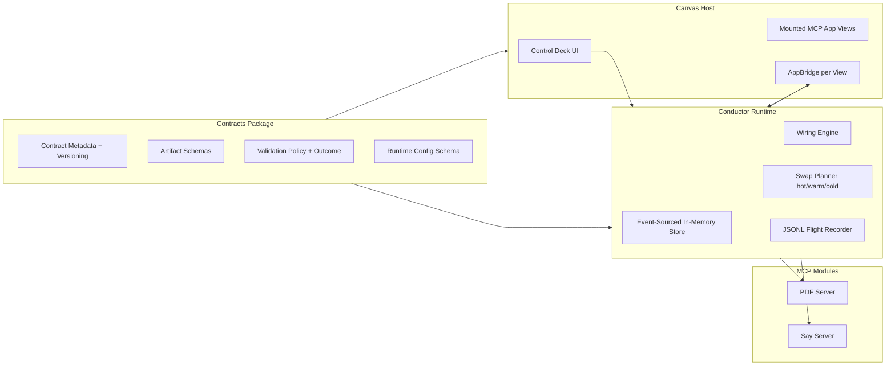

# The Living Doc

Last updated: 2026-02-21

## Current System Snapshot



## What Exists Now

- `packages/contracts`
: Contract Spine v1 contracts are live:
  - `core`: semver `contractVersion` checks (supported major `1`), `kind`, `extensions`
  - `artifacts`: manifests/runtime profiles/module profiles/events/wiring/state schemas
  - `validation`: validation modes, boundaries, policy, issues, outcomes
  - `runtime-config`: `canvas.runtimeConfig` and `canvas.persistedModule` schemas + defaults

- `packages/conductor`
: Runtime API with:
  - `createConductor(config)`
  - `registerModule(...)`
  - `discoverCapabilities(...)`
  - `mountView(...)`
  - `validateWiringEdge(...)`
  - `connectPorts(...)`
  - `swapModule(...)`
  - `emitPortEvent(...)`
  - `reportValidationOutcome(...)`
  - `subscribe(...)`
  - `getState()` / `getMetrics()` / `getTrace()`
  - `close()`
  - Config accepts `validationPolicy`
  - Events are emitted as metadata-rich envelopes (`contractVersion`, `kind`, `extensions`)
  - Wiring edges are validated before commit with trace-visible outcomes (`wiring.validate`, `wiring.reject|warn|accept`).
  - High-signal event payloads are validated via schema map and invalid payloads emit `validation.outcome`.

- `packages/canvas-host`
: Browser host with:
  - multi-server connect (`pdf`, `say`)
  - mount/wire/swap controls
  - lane-based canvas (`main/sidebar/overlay/pip/fullscreen`)
  - AppBridge-based mounted view initialization
  - trace + inventory overlay
  - schema-enforced host ingress for mount args and wire inputs
  - host boundary validation outcomes routed into conductor trace
  - validation panel with latest boundary outcomes and trace IDs
  - host-only strictness toggle (`enforce|warn|observe`) for debug/demo workflows

- `packages/cli`
: `mcp-canvas` commands:
  - `probe`
  - `dev`
  - `connect`
  - `wire`
  - `swap`
  - `doctor`
  - `trace`
  - CLI ingress is schema-enforced for runtime config, profile JSON, and wiring flags
  - validation failures print normalized JSON outcomes to stderr and exit `1`
  - runtime config supports auto-migration from legacy shape to v1 and persists atomically
  - migration summaries are printed explicitly with normalized warnings
  - runtime config writes metadata-rich shape + validation policy

- `examples/proving-ground`
: protocol probe, Contract Spine v1 module profiles, and `scenario:a` (`read-listen`) runner.

## Transport Baseline

- Conductor boundary baseline is **stateless Streamable HTTP**.
- Session-oriented modules are rejected unless a compatible transport adapter is provided.
- `say-server` is normalized to FastMCP constructor settings:
  - `streamable_http_path='/mcp'`
  - `stateless_http=True`
  - constructor-driven host/port.

## Contract Spine v1

Contract Spine v1 is intentionally hard-break and forward-looking.

### Required Metadata

These artifacts require:

- `contractVersion` (semver string; supported major `1`)
- `kind` (artifact-specific literal)
- `extensions` (namespaced extension bag)

Artifact kinds:

- `module.manifest`
- `module.runtimeProfile`
- `module.profile`
- `conductor.event`
- `conductor.wiringEdge`
- `canvas.runtimeConfig`
- `canvas.persistedModule`

### Boundary Validation Behavior

Default policy is hybrid strict:

- `cli.runtimeConfig`: enforce
- `cli.profile`: enforce
- `cli.flags`: enforce
- `host.mountArgs`: enforce
- `host.wireInput`: enforce
- `conductor.wiringEdge`: enforce
- `conductor.eventPayload`: warn
- `conductor.portSignal`: warn

Behavior matrix:

- `enforce`: reject operation
- `warn`: skip invalid dynamic path and emit `validation.outcome`
- `observe`: record-only mode (defined, not defaulted)

Validation outcomes are represented as typed `validation.outcome` events where conductor trace is available.

### Migration Note

Legacy `.mcp-canvas-runtime.json` now auto-migrates on CLI load:

- parse as v1 first
- fallback to legacy schema
- transform to Contract Spine v1 shape
- atomically persist migrated config
- continue command execution while printing migration warnings

Profile JSON without required metadata still fails at `cli.profile` boundary by design.

Minimum runtime config shape now includes:

- `contractVersion`, `kind`, `extensions`
- `modules`
- `wiring`
- `traceFile`
- `validationPolicy`

## State Model

Canonical state is event-driven and in-memory:

- `modules` (registration + status)
- `capabilityInventory` (tools/resources/prompts)
- `wiring` (typed edges)
- `views` (mounted instances)
- `events` (flight timeline)

Flight recorder is append-only JSONL lines from event envelopes. Validation failures may appear as `validation.outcome` events.

## Swap Policy Matrix

Requested mode | Condition | Resolved mode
---|---|---
`auto` | both modules support snapshot+restore + hot | `hot`
`auto` | no hot but both support warm | `warm`
`auto` | otherwise | `cold`
`hot` | hot unsupported, warm supported | `warm`
`hot` | hot/warm unsupported | `cold`
`warm` | warm unsupported | `cold`

All fallback decisions emit trace events (`swap.plan`, `swap.fallback`, `swap.applied`).

## Demo Beat Implemented

`DocumentSource.selectionText -> AudioSink.speak(text)`

- host receives PDF `updateModelContext`
- adapter extracts `<pdf-selection>...</pdf-selection>`
- conductor emits `port.event` on `pdf:selectionText`
- wiring engine routes to `say:say(text)`
- result is traced as tool call/result events

## Conformance Workflow

1. Start ext-app servers (`pdf` on `3001`, `say` on `3002`)
2. Run runtime diagnostics:

```bash
node ./packages/cli/dist/index.js doctor
```

3. Ensure runtime config is v1 shape (legacy files auto-migrate on CLI load)
4. Run CLI probe:

```bash
node ./packages/cli/dist/index.js probe
```

5. Run proving-ground probe:

```bash
pnpm --filter @mcp-app-conductor/proving-ground probe
```

6. Run scenario A:

```bash
pnpm --filter @mcp-app-conductor/proving-ground scenario:a
```

## Known Gaps

- Canvas host currently mounts views and runs AppBridge, but UX is still prototype-grade.
- Swap behavior remaps wiring and traces decision/fallback; deep runtime state migration is not implemented.
- Video/transcript scenarios remain planned.
- Event payload typing is hardened for high-signal events, but a full discriminated union for all event classes is not implemented.
- Runtime diagnostics are currently CLI-first (`doctor`) and not yet a dedicated host diagnostics workflow.
