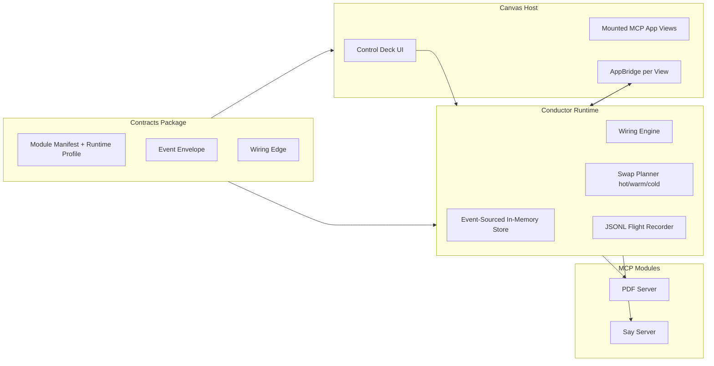

# The Living Doc

Last updated: 2026-02-20

## Current System Snapshot



## What Exists Now

- `packages/contracts`
: Zod contracts for manifests, runtime profile, swap modes, event envelope, wiring edge, mounted views, and conductor state surface.

- `packages/conductor`
: Runtime API with:
  - `createConductor(config)`
  - `registerModule(...)`
  - `discoverCapabilities(...)`
  - `mountView(...)`
  - `connectPorts(...)`
  - `swapModule(...)`
  - `emitPortEvent(...)`
  - `subscribe(...)`
  - `getState()` / `getTrace()`

- `packages/canvas-host`
: Browser host with:
  - multi-server connect (`pdf`, `say`),
  - mount/wire/swap controls,
  - lane-based canvas (`main/sidebar/overlay/pip/fullscreen`),
  - AppBridge-based mounted view initialization,
  - trace + inventory overlay.

- `packages/cli`
: `mcp-canvas` commands:
  - `probe`
  - `dev`
  - `connect`
  - `wire`
  - `swap`
  - `trace`

- `examples/proving-ground`
: protocol probe, module profiles, and `scenario:a` (`read-listen`) runner.

## Transport Baseline

- Conductor boundary baseline is **stateless Streamable HTTP**.
- Session-oriented modules are rejected unless a compatible transport adapter is provided.
- `say-server` is normalized to FastMCP constructor settings:
  - `streamable_http_path='/mcp'`
  - `stateless_http=True`
  - constructor-driven host/port.

## State Model

Canonical state is event-driven and in-memory:

- `modules` (registration + status)
- `capabilityInventory` (tools/resources/prompts)
- `wiring` (typed edges)
- `views` (mounted instances)
- `events` (flight timeline)

Flight recorder is append-only JSONL lines from event envelopes.

## Swap Policy Matrix

Requested mode | Condition | Resolved mode
---|---|---
`auto` | both modules support snapshot+restore + hot | `hot`
`auto` | no hot but both support warm | `warm`
`auto` | otherwise | `cold`
`hot` | hot unsupported, warm supported | `warm`
`hot` | hot/warm unsupported | `cold`
`warm` | warm unsupported | `cold`

All fallback decisions emit trace events (`swap.plan`, `swap.fallback`, `swap.applied`).

## Demo Beat Implemented

`DocumentSource.selectionText -> AudioSink.speak(text)`

- host receives PDF `updateModelContext`
- adapter extracts `<pdf-selection>...</pdf-selection>`
- conductor emits `port.event` on `pdf:selectionText`
- wiring engine routes to `say:say(text)`
- result is traced as tool call/result events

## Conformance Workflow

1. Start ext-app servers (`pdf` on `3001`, `say` on `3002`)
2. Run CLI probe:

```bash
node ./packages/cli/dist/index.js probe
```

3. Run proving-ground probe:

```bash
pnpm --filter @mcp-app-conductor/proving-ground probe
```

4. Run scenario A:

```bash
pnpm --filter @mcp-app-conductor/proving-ground scenario:a
```

## Known Gaps

- Canvas host currently mounts views and runs AppBridge, but UX is still prototype-grade.
- Swap behavior remaps wiring and traces decision/fallback; deep runtime state migration is not implemented.
- Video/transcript scenarios remain planned.
